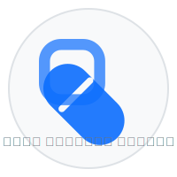

# دليل الأدوية العربي (Arabic Medicine Guide)

منصة معلوماتية شاملة للأدوية باللغة العربية مع التركيز على الأدوية المتوفرة في اليمن.



## نبذة عن المشروع

دليل الأدوية العربي هو تطبيق ويب مفتوح المصدر يهدف إلى توفير معلومات دقيقة وشاملة عن الأدوية باللغة العربية، مع التركيز الأولي على الأدوية المتوفرة في اليمن. المشروع مصمم للعمل كموقع ساكن يمكن استضافته على منصات مثل GitHub Pages ويعمل بالكامل على جانب المتصفح.

يساعد هذا الدليل الأطباء والصيادلة والمرضى في الحصول على معلومات مفصلة ودقيقة عن الأدوية بطريقة سهلة وبسيطة.

## الميزات الرئيسية

- **بحث شامل**: البحث عن الأدوية بالاسم العلمي أو التجاري، الفئة العلاجية، الشركة المصنعة، أو الأعراض.
- **التعرف البصري**: التقاط صورة للدواء والتعرف عليه فوراً مع المعلومات التفصيلية.
- **حاسبة الجرعات**: حساب الجرعة المناسبة بناءً على العمر والوزن والحالة الصحية.
- **معلومات تفصيلية**: معلومات شاملة عن كل دواء تشمل دواعي الاستعمال، الجرعات، الآثار الجانبية، التحذيرات، والبدائل.
- **دعم اللغة العربية**: واجهة كاملة باللغة العربية مع دعم للاتجاه من اليمين إلى اليسار (RTL).
- **التصميم المتجاوب**: يعمل على جميع الأجهزة بمختلف أحجام الشاشات.
- **وضع الإضاءة المنخفضة**: خيار للتبديل بين النمط الفاتح والداكن لراحة العين.

## التقنيات المستخدمة

- **Frontend**: HTML5, CSS3, JavaScript
- **تنسيق البيانات**: JSON
- **إطار العمل**: Bootstrap 5 (RTL)
- **الأيقونات**: Bootstrap Icons
- **الخطوط**: Google Fonts (Tajawal)
- **الاستضافة**: GitHub Pages

## الاستخدام المحلي

1. قم بنسخ المستودع:
   ```
   git clone https://github.com/username/arabic-medicine-guide.git
   ```

2. افتح ملف `index.html` في متصفحك المفضل.

## المساهمة

نرحب بمساهماتكم لتحسين وتطوير الدليل! يمكنكم المساهمة من خلال:

1. إضافة معلومات أدوية جديدة.
2. تحسين الترجمات والمصطلحات الطبية.
3. تطوير واجهة المستخدم وتحسين التجربة.
4. الإبلاغ عن الأخطاء واقتراح التحسينات.

للمساهمة، يرجى:
1. عمل Fork للمشروع.
2. إنشاء فرع جديد (`git checkout -b feature/amazing-feature`).
3. إجراء التغييرات وتسجيلها (`git commit -m 'Add amazing feature'`).
4. رفع التغييرات (`git push origin feature/amazing-feature`).
5. فتح طلب دمج (Pull Request).

## التنبيه القانوني

هذا الدليل يقدم معلومات إرشادية فقط وليس بديلاً عن استشارة الطبيب أو الصيدلي. استشر دائماً أخصائي الرعاية الصحية قبل تناول أي دواء. المؤلفون والمساهمون غير مسؤولين عن أي سوء استخدام للمعلومات الواردة في هذا الدليل.

## الترخيص

هذا المشروع مرخص بموجب [MIT License](LICENSE) - انظر ملف LICENSE للتفاصيل.

## الاتصال

لأية استفسارات أو اقتراحات، يرجى فتح issue في هذا المستودع أو التواصل عبر البريد الإلكتروني.